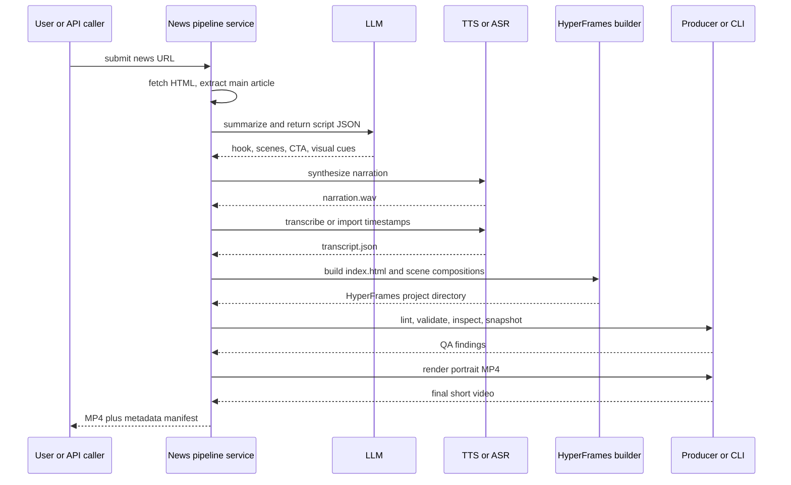

# Hướng dẫn phát triển pipeline tự động từ URL tin tức sang video ngắn với HyperFrames

## Tóm tắt điều hành

HyperFrames là framework mã nguồn mở của HeyGen để “viết HTML, render video”, được thiết kế theo hướng agent-first: video được mô tả bằng HTML/CSS/JS, rồi render một cách deterministic theo từng frame bằng Chrome BeginFrame API thay vì quay màn hình theo thời gian thực. Kiến trúc chính thức của dự án tách rõ ba lớp: `@hyperframes/core` cho kiểu dữ liệu, parser/generator HTML và lint; `@hyperframes/engine` cho capture engine dùng `HeadlessExperimental.beginFrame`; và `@hyperframes/producer` cho pipeline render hoàn chỉnh gồm runtime injection, readiness gates, capture, encode và mix audio. Với bài toán “news URL → short video”, bộ công cụ này đặc biệt phù hợp vì nó cho phép coi mỗi beat/scene của video như một composition HTML, dễ tự động sinh từ kết quả AI tóm tắt và storyboard JSON, rồi xuất ra MP4 dọc 1080×1920 cho TikTok/YouTube Shorts hoặc WebM/MOV có alpha cho overlay chuyên nghiệp. citeturn35search3turn12view1turn12view3turn12view2turn35search12

Điểm quan trọng nhất khi biến HyperFrames thành pipeline sản xuất là phân biệt cái gì thuộc “tầng AI nội dung” và cái gì thuộc “tầng render”. Repository công khai và tài liệu chính thức mô tả rất rõ pipeline 7 bước của HyperFrames: capture, design, script, storyboard, voiceover, build, validate; nhưng không áp đặt một LLM duy nhất cho giai đoạn summarization/scripting. Nghĩa là HyperFrames không buộc bạn dùng OpenAI, Claude, Gemini hay local model nào cho phần biên tập nội dung; nó chỉ cần đầu ra cuối cùng là một project HyperFrames hợp lệ với HTML compositions, asset paths, timeline, audio và transcript. Vì vậy, thiết kế tốt nhất cho bài toán video tin tức là: dùng parser bài báo + LLM/TTS/ASR ở ngoài, chuẩn hóa thành artifact trung gian (`article.json`, `script.json`, `transcript.json`), rồi để HyperFrames đảm nhiệm phần dựng cảnh, hiệu ứng, caption, kiểm tra và render. citeturn20view0turn22view1turn21view6turn35search4

Về mặt triển khai thực tế, nhánh `main` hiện tại cho thấy CLI là điểm vào tốt nhất cho nhóm phát triển, vì nó bọc luôn producer, engine và studio; còn nếu bạn cần tích hợp programmatically trong Node.js service thì `@hyperframes/producer` là API nên dùng. CLI hỗ trợ `init`, `add`, `catalog`, `preview`, `lint`, `inspect`, `snapshot`, `render`, `doctor`, `tts`, `transcribe`, `remove-background`, cùng các chế độ deploy/render phân tán như `lambda`, `cloudrun`, và `cloud render`. Đối với CI/CD và production automation, Docker mode được tài liệu chính thức khuyến nghị vì cho đầu ra deterministic xuyên máy nhờ pin Chrome, font và FFmpeg; còn local mode phù hợp hơn cho vòng lặp chỉnh sửa nhanh. citeturn35search2turn10view2turn10view3turn10view8turn10view6turn12view0turn25view2turn10view1

## Kiến trúc đầu cuối

Kiến trúc phù hợp nhất cho bài toán URL tin tức là pipeline hai pha. Pha thứ nhất là “editorial pipeline”: lấy URL, trích bài viết chính, tóm tắt, dựng script, sinh narration và transcript. Pha thứ hai là “render pipeline”: biến script đã chuẩn hóa thành project HyperFrames với nhiều sub-composition, qua lint/validate/inspect/snapshot, rồi render ra MP4 dọc. Cách chia này bám rất sát triết lý artifact-based pipeline của HyperFrames, nơi mỗi bước tạo ra output rõ ràng cho bước tiếp theo, từ `SCRIPT.md` và `STORYBOARD.md` đến `narration.wav`, `transcript.json` và `compositions/*.html`. citeturn22view1turn22view2turn22view3turn22view4

```mermaid
flowchart LR
    A[News URL] --> B[Fetcher]
    B --> C[Article parser]
    C --> D[article.json]
    D --> E[LLM summarizer and script generator]
    E --> F[script.json]
    F --> G[TTS]
    G --> H[narration.wav]
    H --> I[ASR or transcript import]
    I --> J[transcript.json]
    D --> K[Asset resolver]
    K --> L[images logos background music]
    F --> M[HyperFrames project builder]
    J --> M
    L --> M
    M --> N[index.html plus compositions]
    N --> O[lint validate inspect snapshot]
    O --> P[@hyperframes/producer or CLI render]
    P --> Q[MP4 1080x1920]
    P --> R[WebM overlay or MOV alpha]
```

Trong sơ đồ trên, parser bài báo nên chạy trước mọi bước AI sáng tạo để giảm hallucination. HyperFrames pipeline guide nhấn mạnh rằng script phải bám vào nguồn thật và “không invent claims the source doesn’t support”; transcript rồi mới trở thành nguồn chân lý cho timing beat-by-beat. Ở phía render, `@hyperframes/producer` sẽ orchestrate việc load composition HTML, inject runtime, chờ `window.__playerReady` và `window.__renderReady`, capture frame qua engine, encode MP4/WebM bằng FFmpeg, rồi mix audio. citeturn22view2turn22view3turn12view2turn15view2



Về mặt reasoning kỹ thuật, cách tốt nhất để tận dụng HyperFrames cho short-video chuyên nghiệp là đặt mỗi “beat” của bản tin thành một sub-composition, còn root composition chỉ làm nhiệm vụ timeline host cho narration, music, captions và transitions. Điều này khớp với schema HyperFrames: HTML là source of truth; `data-start`, `data-duration`, `data-track-index` điều khiển timing; sub-composition dùng `data-composition-src`; variables được truyền qua `data-variable-values`; và timeline GSAP phải được đăng ký trên `window.__timelines` với trạng thái paused để renderer có thể seek từng frame một cách deterministic. citeturn20view4turn20view6turn20view5turn28search1turn34view4

## Điều kiện tiên quyết và thiết lập môi trường

Tài liệu chính thức của HyperFrames hiện xem Node.js 22.x, FFmpeg 7.x, FFprobe 7.x, Chrome và Docker là các dependency cốt lõi cần kiểm tra bằng `hyperframes doctor`. CLI README trong repo cũng nêu yêu cầu “Node.js >= 22, FFmpeg”, còn tài liệu rendering minh họa output kỳ vọng của `doctor` với Node 22.x, FFmpeg/FFprobe 7.x, Chrome và Docker. Repo không yêu cầu Python cho phần render; vì vậy nếu bạn muốn thêm Python vào pipeline thì đó là quyết định kiến trúc của bạn, không phải yêu cầu của HyperFrames. Ngoài ra, `.env.example` cho biết basic usage không cần biến môi trường; `GEMINI_API_KEY` chỉ là tích hợp tùy chọn cho website capture/generative descriptions. citeturn37view0turn20view2turn10view5turn17view0

| Hạng mục | Trạng thái theo tài liệu HyperFrames | Khuyến nghị cho pipeline news-to-short |
|---|---|---|
| Node.js | Bắt buộc, dòng 22.x / `>=22` | Pin Node 22 trong dev và CI |
| FFmpeg / FFprobe | Bắt buộc cho render/audio | Cài sẵn trên runner hoặc dùng Docker |
| Chrome / `chrome-headless-shell` | Cần cho capture | Dùng Docker trong CI để ổn định |
| Docker | Không bắt buộc nhưng rất khuyến nghị cho deterministic render | Bật trong staging/prod |
| Python | Không bắt buộc, không được repo chỉ định | Để trống nếu đi Node-only; chỉ thêm nếu cần worker NLP riêng |
| GPU | Tùy chọn; hỗ trợ encode hardware và browser GPU local | CPU-first trong CI, GPU cho local acceleration |

Gói cài đặt tối thiểu cho một service Node-based nên gồm HyperFrames CLI, producer/core, parser bài báo và SDK LLM. Cấu hình dưới đây đủ để bắt đầu một pipeline thực dụng, trong đó `hyperframes` dùng cho `doctor`, `tts`, `transcribe`, `lint`, `validate`, `inspect`, `snapshot`, và `render`; còn `@hyperframes/producer` dùng khi bạn muốn render trực tiếp trong code thay vì `child_process`. Cách cài này phù hợp với kiến trúc chính thức: end-user nên bắt đầu bằng CLI, còn script/service Node nên dùng producer khi cần programmatic control. citeturn35search2turn12view2

```bash
# Tạo project service mới
mkdir news-to-short && cd news-to-short
npm init -y

# HyperFrames runtime/render
npm i hyperframes @hyperframes/core @hyperframes/producer gsap

# Parse bài báo + orchestration
npm i @mozilla/readability jsdom fs-extra execa zod dotenv

# Ví dụ LLM bằng OpenAI
npm i openai

# Dev tooling
npm i -D typescript tsx @types/node

# Kiểm tra môi trường render
npx hyperframes doctor
```

Nếu bạn muốn nghiên cứu hoặc patch chính repo `heygen-com/hyperframes`, quy trình chính thức là clone repo, chạy `bun install`, `bun run build`, `bun run dev`, và `bun run --filter '*' test`. `AGENTS.md` trong repo còn nhấn mạnh dùng Bun cho workspace operations, tránh pnpm, đồng thời chạy `npx hyperframes lint` và `npx hyperframes validate` sau mỗi lần chỉnh composition HTML. Pre-commit hooks hiện tại dùng `lefthook` + `oxlint` + `oxfmt`. citeturn36view0turn17view2turn17view3

```bash
git clone https://github.com/heygen-com/hyperframes.git
cd hyperframes

bun install
bun run build
bun run dev
bun run --filter '*' test
```

Với short-video dọc, có hai điểm vào tốt. Cách thứ nhất là scaffold project trống rồi đặt canvas portrait bằng `--resolution portrait`, như nguồn `init.ts` hiện tại minh họa. Cách thứ hai là scaffold từ example portrait `vignelli`, vốn docs mô tả là 1080×1920, typography mạnh và phù hợp “headlines & announcements”. Trong cả hai trường hợp, project chuẩn sinh ra sẽ có `meta.json`, `index.html`, `compositions/`, `assets/`, `package.json` scripts như `dev`, `check`, `render`, `publish`, và `hyperframes.json` để lệnh `add` biết registry/path đích. citeturn41view2turn42view4turn32view0turn32view1turn42view0turn42view2

Một layout đội ngũ vận hành hay dùng cho news-to-short có thể như sau. Tôi giữ cấu trúc artifact bám sát pipeline guide của HyperFrames, nhưng thêm `src/` và `dist/` để thuận tiện triển khai service. Cấu trúc này là đề xuất kiến trúc, không phải template chính thức của repo. Nó tương thích tốt với cách HyperFrames tổ chức `SCRIPT.md`, `STORYBOARD.md`, `narration.wav`, `transcript.json` và `compositions/*.html`. citeturn22view2turn22view3turn35search1

```text
news-to-short/
├── package.json
├── tsconfig.json
├── .env
├── config/
│   └── pipeline.yaml
├── src/
│   ├── fetch-article.ts
│   ├── generate-script.ts
│   ├── build-hyperframes.ts
│   ├── render-video.ts
│   └── main.ts
├── work/
│   └── run-<timestamp>/
│       ├── article.json
│       ├── SCRIPT.md
│       ├── STORYBOARD.md
│       ├── narration.wav
│       ├── transcript.json
│       ├── index.html
│       ├── compositions/
│       │   ├── scene-01-hook.html
│       │   ├── scene-02-context.html
│       │   ├── scene-03-proof.html
│       │   └── captions.html
│       └── assets/
│           ├── bgm.mp3
│           ├── logo.png
│           ├── scene-01-bg.jpg
│           ├── scene-02-bg.jpg
│           └── overlay.webm
└── dist/
    └── final.mp4
```

## Giải phẫu repo HyperFrames

Ở mức monorepo, `AGENTS.md` là nguồn tổng hợp đáng tin nhất về cấu trúc dự án hiện tại. Tài liệu này liệt kê `packages/cli`, `core`, `engine`, `player`, `producer`, `studio`, cùng `registry/`, `examples/`, `docs/` và `skills/`. Phần `contributing` trên docs xác nhận lại mapping chính giữa package path và vai trò kỹ thuật của chúng. Điểm đáng chú ý cho automation là CLI hiện vẫn là lớp khuyến nghị bắt đầu, còn studio chỉ cần cài trực tiếp khi bạn embed editor. citeturn17view2turn36view0turn36view1turn35search2

| Thư mục / package | Vai trò trong pipeline | Điểm cần nhớ cho bài toán tin tức |
|---|---|---|
| `packages/core` | Types, parsing/generation HTML, lint, runtime, frame adapters | Dùng để validate/generate composition HTML, variables, lint programmatically |
| `packages/engine` | Frame capture engine dùng BeginFrame | Chỉ dùng trực tiếp khi bạn muốn kiểm soát capture thấp tầng |
| `packages/producer` | Pipeline render hoàn chỉnh | Lựa chọn tốt nhất cho service Node render MP4/WebM |
| `packages/cli` | CLI để init/add/preview/lint/render/tts/transcribe | Điểm vào nhanh nhất cho team dev và CI |
| `packages/studio` | Browser editor + timeline + preview | Hữu ích cho QA và chỉnh thủ công |
| `packages/player` | Web component `<hyperframes-player>` | Không cần cho render nhưng hữu ích nếu nhúng review preview vào dashboard |
| `registry/` | Blocks/components/examples để cài vào project | Nguồn hiệu ứng, caption style, overlay, transition dùng lại |
| `docs/` | Mintlify docs site | `docs/docs.json` mô tả điều hướng tài liệu hiện hành |

Về API bề mặt, `@hyperframes/core` xuất ra hầu như toàn bộ building blocks mà một generator cần: kiểu dữ liệu timeline/composition/variables, `parseHtml`, `updateElementInHtml`, `addElementToHtml`, `removeElementFromHtml`, `validateCompositionHtml`, `extractCompositionMetadata`, `generateHyperframesHtml`, `generateGsapTimelineScript`, `generateHyperframesStyles`, `lintHyperframeHtml`, `validateVariables`, `createGSAPFrameAdapter`, cùng utility templates như `generateBaseHtml` và `getStageStyles`. Điều này có nghĩa là nếu bạn muốn viết “compiler” riêng từ `script.json` sang project HyperFrames, `core` là package phù hợp nhất cho phần compile-time; còn nếu bạn chỉ cần kết quả thực dụng, template strings cũng hoàn toàn hợp lệ. citeturn9view0turn12view1turn13view1turn13view2turn13view3turn13view7

`@hyperframes/engine` là lớp low-level cho deterministic capture, với API theo session như `createCaptureSession`, `initializeSession`, `captureFrame`, `captureFrameToBuffer`, `getCompositionDuration`, `closeCaptureSession`, cộng với browser management (`acquireBrowser`, `resolveHeadlessShellPath`, `buildChromeArgs`), encoding (`encodeFramesFromDir`, `muxVideoWithAudio`, `applyFaststart`, `detectGpuEncoder`), audio processing (`parseAudioElements`, `processCompositionAudio`), parallel rendering (`calculateOptimalWorkers`, `executeParallelCapture`) và file server (`createFileServer`). Với bài toán news-to-short, bạn thường không cần chạm trực tiếp lớp này trừ khi muốn build custom sprite sheets, thumbnails, hay streaming encoder riêng. citeturn9view1turn14view0turn14view1turn14view2turn14view3turn14view5turn14view6turn14view4

`@hyperframes/producer` là package quan trọng nhất cho service backend. Nó cung cấp `createRenderJob`, `executeRenderJob`, `RenderCancelledError`, config resolution, logger pluggable, HTTP server endpoints (`POST /render`, `POST /render/stream`, `POST /lint`, `GET /health`, `GET /outputs/:token`) và cả các primitive distributed render. Tài liệu producer mô tả rõ pipeline của nó: load HTML, inject runtime, chờ readiness gates, capture qua engine, encode MP4/WebM bằng FFmpeg, rồi mix audio từ `<video>` và `<audio>` theo `data-volume` và `data-media-start`. Đây là lý do tôi khuyên dùng producer cho bước render trong kiến trúc service. citeturn9view2turn12view2turn15view0turn15view1turn15view2turn15view3

Ở lớp CLI, current docs cho thấy các nhóm lệnh quan trọng gồm `init`, `add`, `catalog`, `preview`, `publish`, `lint`, `inspect`, `snapshot`, `render`, `benchmark`, `doctor`, `tts`, `transcribe`, `remove-background`, `upgrade`, và các nhóm deploy `lambda`, `cloudrun`, `cloud`. Với pipeline tin tức, bộ tối thiểu nên thuộc nằm lòng là: `init` để scaffold, `add` để cài registry item, `preview` để xem live trong Studio, `lint` và `validate` để chặn lỗi cấu trúc/runtime, `inspect` để bắt overflow layout, `snapshot` để QA nhanh, `render` để xuất MP4/WebM, `tts` để voice off local, và `transcribe` để lấy word timestamps. citeturn10view2turn10view3turn10view8turn10view7turn10view6turn12view0turn10view5turn33view0turn33view1turn24search3turn24search5

Một insight rất đáng giá từ source `init.ts` và `templates/generators.ts` là hiện chỉ template `blank` được bundled offline; các example còn lại được resolve từ registry “remote examples”. Nghĩa là trong môi trường kín mạng hoặc build reproducible tuyệt đối, bạn nên dựa vào `blank` hoặc vendor sẵn template/example mong muốn vào repository riêng của mình. Cũng từ `init.ts`, project mới sẽ tự sinh `meta.json`, `hyperframes.json`, `package.json` scripts, và có thể patch nguồn video, transcript và Tailwind browser runtime theo flag scaffold. citeturn41view0turn41view1turn42view0turn42view2

Registry hiện là một tài sản lớn của repo. `registry/registry.json` liệt kê examples, blocks và components như caption styles, social overlays, shader transitions, lower-thirds, data blocks và VFX. Với short-video tin tức, các item hữu ích ngay lập tức gồm `caption-editorial-emphasis` cho caption phong cách báo chí, `flash-through-white` cho transition kiểu newsroom/cinematic, `tiktok-follow` hoặc `yt-lower-third` cho CTA/branding overlay, và các effect như `grain-overlay`. `hyperframes add` đọc `hyperframes.json`, cài item và sinh snippet paste vào project hiện có; docs catalog cũng nêu mỗi block/component chỉ là file + metadata, phù hợp cho automation. citeturn30view0turn31view0turn31view1turn31view2turn34view0turn34view4

## Triển khai pipeline từ URL tin tức sang video ngắn

Phần dưới đây là một triển khai tham chiếu theo stack Node.js. Tôi cố ý chọn `@mozilla/readability` cho parser vì đây là bản standalone chính thức của thư viện Reader View của Firefox; đồng thời nhắc thêm `trafilatura` như lựa chọn Python nếu đội bạn muốn fallback extractor riêng. Ở tầng AI, tôi dùng OpenAI trong ví dụ minh họa vì docs chính thức mô tả Responses API là bề mặt chuẩn cho direct model requests và structured text generation; tuy vậy, HyperFrames không áp đặt provider, nên adapter có thể hoán đổi sang Anthropic Messages API, Gemini `generateContent`, hoặc Ollama local API tùy yêu cầu dữ liệu và hạ tầng. citeturn43search0turn43search1turn43search5turn43search9turn43search2turn43search18turn44search0turn44search16turn44search1turn44search13turn44search2

**Bước lấy và parse bài báo.** Đoạn dưới đây là file `src/fetch-article.ts`. Nó fetch HTML bằng Node 22, chạy Readability trên DOM, và chuẩn hóa về JSON gọn phục vụ summarization. Trong production, nếu gặp article pages quá nhiều script hoặc paywall, bạn nên thêm fallback extractor hoặc headless fetch path; còn đối với đa số article pages công khai, pattern này là hợp lý và dễ vận hành. citeturn43search0turn43search1turn43search9

```ts
// src/fetch-article.ts
import { JSDOM } from "jsdom";
import { Readability } from "@mozilla/readability";

export interface ParsedArticle {
  url: string;
  title: string;
  byline?: string;
  siteName?: string;
  excerpt?: string;
  contentText: string;
  contentHtml?: string;
  publishedAt?: string;
}

export async function fetchAndParseArticle(url: string): Promise<ParsedArticle> {
  const response = await fetch(url, {
    redirect: "follow",
    headers: {
      // Giữ UA ổn định để tránh một số site trả HTML mobile lạ hoặc anti-bot quá gắt.
      "user-agent": "news-to-short/1.0 (+deterministic build pipeline)",
      "accept-language": "vi,en-US;q=0.9,en;q=0.8",
    },
  });

  if (!response.ok) {
    throw new Error(`Cannot fetch article: ${response.status} ${response.statusText}`);
  }

  const html = await response.text();
  const dom = new JSDOM(html, { url });

  const article = new Readability(dom.window.document).parse();
  if (!article || !article.textContent?.trim()) {
    throw new Error("Readability failed to extract main article text.");
  }

  // Tìm published time theo các meta phổ biến; có thể mở rộng sau.
  const metaSelectors = [
    'meta[property="article:published_time"]',
    'meta[name="article:published_time"]',
    'meta[property="og:updated_time"]',
    "time[datetime]",
  ];

  let publishedAt: string | undefined;
  for (const selector of metaSelectors) {
    const el = dom.window.document.querySelector(selector);
    const value =
      el?.getAttribute("content") ??
      el?.getAttribute("datetime") ??
      undefined;
    if (value) {
      publishedAt = value;
      break;
    }
  }

  return {
    url,
    title: article.title?.trim() || "Untitled article",
    byline: article.byline?.trim() || undefined,
    siteName: article.siteName?.trim() || undefined,
    excerpt: article.excerpt?.trim() || undefined,
    contentText: article.textContent.trim(),
    contentHtml: article.content ?? undefined,
    publishedAt,
  };
}
```

**Bước tóm tắt và sinh kịch bản JSON.** HyperFrames pipeline guide nhấn mạnh script phải đi trước storyboard, và beat durations phải xuất phát từ narration rồi mới “snap” lại bằng transcript word-level timestamps. Vì vậy, LLM output tốt nhất không phải một paragraph tự do, mà là JSON có cấu trúc gồm `hook`, `scenes`, `visual cues`, `cta`, `estimated narration`, và hạn chế rõ ràng về số câu/độ dài. Ví dụ sau dùng OpenAI Responses API; nếu bạn thay provider, hãy giữ nguyên contract đầu ra. Tôi cũng cố ý ép model “không thêm claim ngoài nguồn”, vì đây là nguyên tắc được HyperFrames pipeline docs nhấn mạnh cho `SCRIPT.md`. citeturn22view2turn22view3turn43search2turn43search18turn44search0turn44search1turn44search2

```ts
// src/generate-script.ts
import OpenAI from "openai";
import { z } from "zod";
import type { ParsedArticle } from "./fetch-article.js";

const SceneSchema = z.object({
  id: z.string(),
  purpose: z.enum(["hook", "context", "proof", "impact", "cta"]),
  headline: z.string(),
  voiceover: z.string(),
  onScreenText: z.string(),
  visualDirection: z.string(),
  backgroundAssetHint: z.string(),
  transitionIn: z.string(),
  transitionOut: z.string(),
  estimatedDurationSec: z.number().positive(),
});

export const VideoPlanSchema = z.object({
  title: z.string(),
  deck: z.string().optional(),
  tone: z.string(),
  language: z.string(),
  totalEstimatedDurationSec: z.number().positive(),
  scenes: z.array(SceneSchema).min(3).max(6),
  hashtags: z.array(z.string()).max(8),
});

export type VideoPlan = z.infer<typeof VideoPlanSchema>;

export interface GeneratePlanOptions {
  model: string;           // Ví dụ: "gpt-5.1", "gpt-4.1", hoặc model bạn chọn.
  language?: string;       // Mặc định: "vi"
  maxDurationSec?: number; // Ví dụ 30 hoặc 45
}

export async function generateVideoPlan(
  article: ParsedArticle,
  options: GeneratePlanOptions,
): Promise<VideoPlan> {
  const client = new OpenAI({ apiKey: process.env.OPENAI_API_KEY });

  const language = options.language ?? "vi";
  const maxDurationSec = options.maxDurationSec ?? 30;

  const systemPrompt = [
    "Bạn là biên tập viên video tin tức ngắn cho TikTok/YouTube Shorts.",
    "Nhiệm vụ: tạo kịch bản video bám sát nguồn.",
    "Không được thêm thông tin không có trong article.",
    "Ưu tiên rõ ràng, nhịp nhanh, chuyên nghiệp, giọng báo chí hiện đại.",
    "Trả về JSON hợp lệ đúng schema.",
    `Ngôn ngữ đầu ra: ${language}.`,
    `Thời lượng tối đa: ${maxDurationSec} giây.`,
    "Mỗi scene phải có headline, voiceover, onScreenText, visualDirection, transitionIn, transitionOut.",
  ].join(" ");

  const userPrompt = {
    article: {
      url: article.url,
      title: article.title,
      byline: article.byline,
      siteName: article.siteName,
      excerpt: article.excerpt,
      publishedAt: article.publishedAt,
      contentText: article.contentText.slice(0, 12000), // giới hạn token để tiết kiệm chi phí
    },
    requirements: {
      targetFormat: "9:16 vertical short",
      audience: "mobile social audience",
      structure: ["hook", "context", "proof", "impact", "cta"],
      keepClaimsStrictlyGrounded: true,
    },
  };

  const response = await client.responses.create({
    model: options.model,
    input: [
      { role: "system", content: systemPrompt },
      { role: "user", content: JSON.stringify(userPrompt) },
    ],
    text: {
      format: {
        type: "json_schema",
        name: "news_short_video_plan",
        schema: {
          type: "object",
          additionalProperties: false,
          required: ["title", "tone", "language", "totalEstimatedDurationSec", "scenes", "hashtags"],
          properties: {
            title: { type: "string" },
            deck: { type: "string" },
            tone: { type: "string" },
            language: { type: "string" },
            totalEstimatedDurationSec: { type: "number" },
            hashtags: {
              type: "array",
              items: { type: "string" },
              maxItems: 8
            },
            scenes: {
              type: "array",
              minItems: 3,
              maxItems: 6,
              items: {
                type: "object",
                additionalProperties: false,
                required: [
                  "id",
                  "purpose",
                  "headline",
                  "voiceover",
                  "onScreenText",
                  "visualDirection",
                  "backgroundAssetHint",
                  "transitionIn",
                  "transitionOut",
                  "estimatedDurationSec"
                ],
                properties: {
                  id: { type: "string" },
                  purpose: {
                    type: "string",
                    enum: ["hook", "context", "proof", "impact", "cta"]
                  },
                  headline: { type: "string" },
                  voiceover: { type: "string" },
                  onScreenText: { type: "string" },
                  visualDirection: { type: "string" },
                  backgroundAssetHint: { type: "string" },
                  transitionIn: { type: "string" },
                  transitionOut: { type: "string" },
                  estimatedDurationSec: { type: "number" }
                }
              }
            }
          }
        },
        strict: true,
      },
    },
  });

  const parsed = JSON.parse(response.output_text);
  return VideoPlanSchema.parse(parsed);
}
```

**Bước tạo narration và transcript.** Một lợi thế lớn của HyperFrames CLI là TTS local với Kokoro-82M qua `hyperframes tts` và ASR local qua `hyperframes transcribe`, đồng thời `transcribe` còn nhập được JSON từ OpenAI Whisper API, SRT và VTT. Nếu bạn muốn chi phí thấp và dữ liệu không rời máy, đây là mặc định hợp lý. Nếu bạn cần độ tự nhiên cao hơn, có thể thay TTS layer bằng ElevenLabs hoặc Gemini TTS rồi vẫn nhập transcript theo cùng contract `[{text,start,end}]`. citeturn33view0turn33view1turn33view2turn43search3turn44search17

```ts
// src/tts-and-transcribe.ts
import fs from "node:fs/promises";
import path from "node:path";
import { execa } from "execa";
import type { VideoPlan } from "./generate-script.js";

export async function synthesizeAndTranscribe(
  plan: VideoPlan,
  workDir: string,
  voice = "af_nova",
): Promise<{ narrationPath: string; transcriptPath: string }> {
  const scriptPath = path.join(workDir, "SCRIPT.md");
  const narrationPath = path.join(workDir, "narration.wav");
  const transcriptPath = path.join(workDir, "transcript.json");

  // Ghép voiceover của từng scene thành script cuối cùng.
  const narrationText = plan.scenes.map((s) => s.voiceover.trim()).join("\n\n");
  await fs.writeFile(scriptPath, narrationText, "utf8");

  // TTS local bằng HyperFrames CLI
  await execa("npx", [
    "hyperframes",
    "tts",
    scriptPath,
    "--voice",
    voice,
    "--output",
    narrationPath,
  ], { stdio: "inherit" });

  // Transcribe để lấy word-level timestamps.
  // Lệnh này sẽ tạo transcript.json chuẩn cho captions.
  await execa("npx", [
    "hyperframes",
    "transcribe",
    narrationPath,
  ], {
    cwd: workDir,
    stdio: "inherit",
  });

  return { narrationPath, transcriptPath };
}
```

**Bước map script sang scenes/timeline HyperFrames.** Đây là phần cốt lõi. Tôi khuyên dựng `index.html` như “master timeline”, trong đó mỗi news beat là một sub-composition portrait 1080×1920; variables được bơm qua `data-variable-values`; narration và BGM nằm ở root; captions là một sub-composition xuyên suốt. Cách làm này bám theo schema chính thức của HyperFrames: HTML là source of truth, sub-compositions dùng `data-composition-src`, variables đọc bằng `__hyperframes.getVariables()`, media URLs có thể được gán từ variable và renderer sẽ probe lại DOM sau khi script chạy. Đồng thời, các timed visible layer vẫn cần `class="clip"` và timeline GSAP phải được đăng ký trên `window.__timelines`. citeturn20view4turn20view6turn20view5turn28search1turn34view4

```ts
// src/build-hyperframes.ts
import fs from "node:fs/promises";
import path from "node:path";
import type { VideoPlan } from "./generate-script.js";

interface TranscriptWord {
  text: string;
  start: number;
  end: number;
}

function esc(value: string): string {
  return value
    .replaceAll("&", "&amp;")
    .replaceAll("<", "&lt;")
    .replaceAll(">", "&gt;")
    .replaceAll('"', "&quot;");
}

function jsonAttr(value: unknown): string {
  return esc(JSON.stringify(value));
}

function chunkCaptions(words: TranscriptWord[], wordsPerLine = 4) {
  const chunks: { text: string; start: number; end: number }[] = [];
  for (let i = 0; i < words.length; i += wordsPerLine) {
    const slice = words.slice(i, i + wordsPerLine);
    if (slice.length === 0) continue;
    chunks.push({
      text: slice.map((w) => w.text).join(" "),
      start: slice[0]!.start,
      end: slice[slice.length - 1]!.end,
    });
  }
  return chunks;
}

function sceneHtml(sceneId: string, durationSec: number): string {
  return `<!doctype html>
<html data-composition-variables='[
  {"id":"headline","type":"string","default":"Untitled"},
  {"id":"body","type":"string","default":""},
  {"id":"bgImage","type":"string","default":""},
  {"id":"logoImage","type":"string","default":""},
  {"id":"overlayVideo","type":"string","default":""},
  {"id":"accent","type":"color","default":"#F43F5E"}
]'>
<head>
  <meta charset="utf-8" />
  <meta name="viewport" content="width=1080, height=1920, initial-scale=1" />
  <style>
    html, body {
      margin: 0;
      width: 1080px;
      height: 1920px;
      overflow: hidden;
      background: #0b0b10;
      font-family: Inter, Arial, sans-serif;
      color: #fff;
    }
    [data-composition-id="${sceneId}"] {
      position: relative;
      width: 1080px;
      height: 1920px;
      overflow: hidden;
      background: #0b0b10;
    }
    .bg, .overlay-video, .vignette, .gradient {
      position: absolute;
      inset: 0;
      width: 100%;
      height: 100%;
    }
    .bg {
      object-fit: cover;
      filter: saturate(1.05) contrast(1.02);
      transform: scale(1.04);
    }
    .overlay-video {
      object-fit: cover;
      mix-blend-mode: screen;
      opacity: 0.25;
      pointer-events: none;
    }
    .gradient {
      background:
        linear-gradient(180deg, rgba(0,0,0,0.18) 0%, rgba(0,0,0,0.44) 50%, rgba(0,0,0,0.84) 100%);
    }
    .vignette {
      box-shadow: inset 0 0 220px rgba(0,0,0,0.35);
      pointer-events: none;
    }
    .top-kicker {
      position: absolute;
      left: 56px;
      top: 72px;
      padding: 14px 20px;
      border-radius: 999px;
      background: rgba(255,255,255,0.10);
      backdrop-filter: blur(12px);
      font-size: 30px;
      letter-spacing: 0.08em;
      text-transform: uppercase;
    }
    .headline {
      position: absolute;
      left: 56px;
      right: 56px;
      bottom: 560px;
      font-size: 96px;
      line-height: 0.94;
      font-weight: 800;
      text-wrap: balance;
    }
    .body {
      position: absolute;
      left: 56px;
      right: 56px;
      bottom: 300px;
      font-size: 40px;
      line-height: 1.25;
      color: rgba(255,255,255,0.92);
    }
    .accent-bar {
      position: absolute;
      left: 56px;
      bottom: 252px;
      width: 170px;
      height: 8px;
      border-radius: 999px;
      background: var(--accent, #F43F5E);
    }
    .logo {
      position: absolute;
      top: 72px;
      right: 56px;
      width: 88px;
      height: 88px;
      object-fit: contain;
      border-radius: 22px;
      background: rgba(255,255,255,0.08);
      padding: 10px;
    }
  </style>
</head>
<body>
  <div data-composition-id="${sceneId}" data-width="1080" data-height="1920" data-duration="${durationSec}">
    
    <video id="overlayFx" class="clip overlay-video" muted playsinline data-start="0" data-duration="${durationSec}" data-track-index="1"></video>
    <div class="clip gradient" data-start="0" data-duration="${durationSec}" data-track-index="2"></div>
    <div class="clip vignette" data-start="0" data-duration="${durationSec}" data-track-index="3"></div>

    
    <div id="kicker" class="clip top-kicker" data-start="0.08" data-duration="${durationSec - 0.08}" data-track-index="5">Breaking</div>
    <h1 id="headline" class="clip headline" data-start="0.12" data-duration="${durationSec - 0.12}" data-track-index="6"></h1>
    <p id="body" class="clip body" data-start="0.20" data-duration="${durationSec - 0.20}" data-track-index="7"></p>
    <div id="accentBar" class="clip accent-bar" data-start="0.22" data-duration="${durationSec - 0.22}" data-track-index="8"></div>

    <script src="https://cdn.jsdelivr.net/npm/gsap@3/dist/gsap.min.js"></script>
    <script>
      const { headline, body, bgImage, logoImage, overlayVideo, accent = "#F43F5E" } = __hyperframes.getVariables();

      const root = document.querySelector('[data-composition-id="${sceneId}"]');
      const bg = document.getElementById("bg");
      const logo = document.getElementById("logo");
      const fx = document.getElementById("overlayFx");
      const headlineEl = document.getElementById("headline");
      const bodyEl = document.getElementById("body");

      root.style.setProperty("--accent", accent);
      headlineEl.textContent = headline || "";
      bodyEl.textContent = body || "";

      if (bgImage) bg.src = bgImage;
      if (logoImage) logo.src = logoImage;
      if (overlayVideo) fx.src = overlayVideo;

      const tl = gsap.timeline({ paused: true });

      // Entrance
      tl.fromTo(bg, { scale: 1.08, opacity: 0.0 }, { scale: 1.0, opacity: 1, duration: 0.6, ease: "power2.out" }, 0);
      tl.fromTo("#kicker", { y: -30, opacity: 0 }, { y: 0, opacity: 1, duration: 0.28, ease: "power2.out" }, 0.08);
      tl.fromTo("#logo", { y: -24, opacity: 0, scale: 0.92 }, { y: 0, opacity: 1, scale: 1, duration: 0.28, ease: "power2.out" }, 0.10);
      tl.fromTo("#headline", { y: 64, opacity: 0 }, { y: 0, opacity: 1, duration: 0.38, ease: "power3.out" }, 0.16);
      tl.fromTo("#body", { y: 36, opacity: 0 }, { y: 0, opacity: 1, duration: 0.32, ease: "power2.out" }, 0.26);
      tl.fromTo("#accentBar", { scaleX: 0, transformOrigin: "left center", opacity: 0.7 }, { scaleX: 1, opacity: 1, duration: 0.28, ease: "power2.out" }, 0.30);

      // Subtle motion for “broadcast polish”
      tl.to(bg, { scale: 1.03, duration: ${Math.max(durationSec - 0.8, 0.3)}, ease: "none" }, 0.6);

      // Outro transition
      tl.to(["#headline", "#body", "#kicker", "#logo", "#accentBar"], {
        y: -18,
        opacity: 0,
        duration: 0.18,
        stagger: 0.02,
        ease: "power1.in"
      }, ${Math.max(durationSec - 0.22, 0.1)});
      tl.to(bg, { opacity: 0.86, duration: 0.18, ease: "power1.in" }, ${Math.max(durationSec - 0.22, 0.1)});

      window.__timelines = window.__timelines || {};
      window.__timelines["${sceneId}"] = tl;
    </script>
  </div>
</body>
</html>`;
}

function captionsHtml(chunks: { text: string; start: number; end: number }[], totalDurationSec: number): string {
  const nodes = chunks
    .map((chunk, idx) => {
      const duration = Math.max(chunk.end - chunk.start, 0.12);
      return `
        <div
          id="cap-${idx}"
          class="clip caption-line"
          data-start="${chunk.start.toFixed(3)}"
          data-duration="${duration.toFixed(3)}"
          data-track-index="50"
        >${esc(chunk.text)}</div>`;
    })
    .join("\n");

  return `<!doctype html>
<html>
<head>
  <meta charset="utf-8" />
  <meta name="viewport" content="width=1080, height=1920, initial-scale=1" />
  <style>
    html, body {
      margin: 0;
      width: 1080px;
      height: 1920px;
      overflow: hidden;
      background: transparent;
      font-family: Inter, Arial, sans-serif;
    }
    [data-composition-id="captions"] {
      position: relative;
      width: 1080px;
      height: 1920px;
      overflow: hidden;
      background: transparent;
    }
    .caption-line {
      position: absolute;
      left: 48px;
      right: 48px;
      bottom: 120px;
      padding: 24px 28px;
      border-radius: 28px;
      background: rgba(0,0,0,0.72);
      backdrop-filter: blur(8px);
      color: white;
      font-size: 52px;
      line-height: 1.1;
      font-weight: 800;
      text-align: center;
      text-wrap: balance;
      opacity: 0;
      transform: translateY(24px) scale(0.98);
      box-shadow: 0 20px 80px rgba(0,0,0,0.32);
    }
  </style>
</head>
<body>
  <div data-composition-id="captions" data-width="1080" data-height="1920" data-duration="${totalDurationSec}">
    ${nodes}
    <script src="https://cdn.jsdelivr.net/npm/gsap@3/dist/gsap.min.js"></script>
    <script>
      const tl = gsap.timeline({ paused: true });
      const lines = Array.from(document.querySelectorAll(".caption-line"));

      for (const el of lines) {
        const start = Number(el.getAttribute("data-start") || "0");
        const duration = Number(el.getAttribute("data-duration") || "0.4");

        tl.fromTo(el,
          { y: 24, opacity: 0, scale: 0.98 },
          { y: 0, opacity: 1, scale: 1, duration: 0.14, ease: "power2.out" },
          start
        );

        tl.to(el,
          { opacity: 0, duration: 0.10, ease: "power1.in" },
          Math.max(start + duration - 0.10, start + 0.04)
        );
      }

      window.__timelines = window.__timelines || {};
      window.__timelines["captions"] = tl;
    </script>
  </div>
</body>
</html>`;
}

export async function buildHyperframesProject(
  plan: VideoPlan,
  transcript: TranscriptWord[],
  workDir: string,
) {
  const compositionsDir = path.join(workDir, "compositions");
  await fs.mkdir(compositionsDir, { recursive: true });

  let cursor = 0;
  const sceneHosts: string[] = [];

  for (let i = 0; i < plan.scenes.length; i++) {
    const scene = plan.scenes[i]!;
    const sceneId = `scene-${String(i + 1).padStart(2, "0")}`;
    const sceneFile = `${sceneId}.html`;
    const duration = Number(scene.estimatedDurationSec.toFixed(2));

    await fs.writeFile(
      path.join(compositionsDir, sceneFile),
      sceneHtml(sceneId, duration),
      "utf8",
    );

    sceneHosts.push(`
      <div
        data-composition-id="${sceneId}"
        data-composition-src="./compositions/${sceneFile}"
        data-start="${cursor.toFixed(2)}"
        data-duration="${duration.toFixed(2)}"
        data-track-index="${10 + i}"
        data-width="1080"
        data-height="1920"
        data-variable-values="${jsonAttr({
          headline: scene.headline,
          body: scene.onScreenText,
          bgImage: `./assets/${sceneId}-bg.jpg`,
          logoImage: "./assets/logo.png",
          overlayVideo: "./assets/overlay.webm",
          accent: i % 2 === 0 ? "#F43F5E" : "#38BDF8",
        })}"
      ></div>`);

    cursor += duration;
  }

  const totalDurationSec = Number(cursor.toFixed(2));
  const captionChunks = chunkCaptions(transcript, 4);

  await fs.writeFile(
    path.join(compositionsDir, "captions.html"),
    captionsHtml(captionChunks, totalDurationSec),
    "utf8",
  );

  const rootHtml = `<!doctype html>
<html>
<head>
  <meta charset="utf-8" />
  <meta name="viewport" content="width=1080, height=1920, initial-scale=1" />
  <style>
    html, body {
      margin: 0;
      width: 1080px;
      height: 1920px;
      overflow: hidden;
      background: #000;
    }
    [data-composition-id="news-short-root"] {
      position: relative;
      width: 1080px;
      height: 1920px;
      overflow: hidden;
      background: #000;
    }
  </style>
</head>
<body>
  <div data-composition-id="news-short-root" data-width="1080" data-height="1920" data-duration="${totalDurationSec}">
    <audio
      id="narration"
      data-start="0"
      data-duration="${totalDurationSec}"
      data-track-index="1"
      src="./narration.wav"
    ></audio>

    <audio
      id="bgm"
      data-start="0"
      data-duration="${totalDurationSec}"
      data-track-index="2"
      data-volume="0.14"
      src="./assets/bgm.mp3"
    ></audio>

    ${sceneHosts.join("\n")}

    <div
      data-composition-id="captions"
      data-composition-src="./compositions/captions.html"
      data-start="0"
      data-duration="${totalDurationSec}"
      data-track-index="99"
      data-width="1080"
      data-height="1920"
    ></div>
  </div>
</body>
</html>`;

  await fs.writeFile(path.join(workDir, "index.html"), rootHtml, "utf8");
}
```

**Bước render, export và ready-to-post preset.** Cho short-video dọc, preset hợp lý nhất là portrait 1080×1920, MP4/H.264, 30fps, chất lượng `standard` trong review loop và `high` cho bản final. Tài liệu render chính thức cho biết preset `draft`, `standard`, `high` tương ứng CRF/x264 preset khác nhau; `standard` mặc định được mô tả là “visually lossless at 1080p”, còn `webm`/`mov` là lựa chọn phù hợp khi bạn cần transparency. Với producer API, phần canvas portrait đến từ chính composition dimensions; còn CLI cho phép supersample hoặc preset `portrait`/`portrait-4k` nếu cần. citeturn26view1turn26view2turn26view0turn11view3

```ts
// src/render-video.ts
import { createRenderJob, executeRenderJob } from "@hyperframes/producer";

export async function renderProject(projectDir: string, outputPath: string) {
  const job = createRenderJob({
    fps: 30,
    quality: "high",   // dùng "standard" cho preview, "high" cho final
    format: "mp4",
    workers: 2,        // tăng khi máy render có 16GB RAM+ và nhiều core
    useGpu: false,     // pin CPU path để reproducible hơn trong CI
    debug: false,
  });

  await executeRenderJob(job, projectDir, outputPath);
}
```

Nếu bạn thích dùng CLI để đơn giản hóa orchestration, batch lệnh dưới đây là quy trình gần “production checklist” nhất cho news short. Nó chạy lint, runtime validate, layout inspect, snapshot, rồi render final. Đây cũng chính là luồng mà pipeline guide và các skill docs của HyperFrames liên tục khuyến khích trước khi giao video. citeturn22view4turn24search0turn24search5turn23view1turn24search13

```bash
# Từ thư mục work/run-12345
npx hyperframes lint
npx hyperframes validate
npx hyperframes inspect --samples 12
npx hyperframes snapshot . --at 1.2,4.8,9.6
npx hyperframes render --docker --output ../../dist/final.mp4
```

Một số registry item đáng cài ngay cho video tin tức là caption styles, overlay social và transition shader. Cơ chế chính thức là `npx hyperframes add <name>`, lệnh này đọc `hyperframes.json`, chép file cần thiết vào project và trả snippet include. Ví dụ điển hình: `caption-editorial-emphasis` để có caption kiểu editorial, `flash-through-white` cho scene transition, và `tiktok-follow` cho overlay CTA dạng 1080×1920, 4.5 giây. citeturn34view0turn31view1turn31view2turn31view0

```bash
npx hyperframes add caption-editorial-emphasis
npx hyperframes add flash-through-white
npx hyperframes add tiktok-follow
```

Nếu đội bạn muốn “AI voice tự nhiên hơn local Kokoro”, “multimodal/scripting tốt hơn”, hoặc “local-only vì privacy”, bảng dưới đây là điểm quyết định thực dụng nhất. HyperFrames không quy định provider nào cho summarization; vì vậy hãy chọn theo SLA, chính sách dữ liệu và chi phí của đội bạn. citeturn21view6turn43search18turn44search0turn44search1turn44search2

| Lựa chọn LLM | API/chế độ chính thức | Nên dùng khi nào | Đánh đổi chính |
|---|---|---|---|
| OpenAI | Responses API cho direct requests, tool use, structured outputs | Cần JSON kỷ luật, orchestration đơn giản, hệ sinh thái rộng | Cloud API, cần kiểm soát key/quota |
| Anthropic Claude | Messages API, SDK chính thức có retry/error handling | Scripting biên tập, reasoning, tone viết dài tốt | Cloud API; JSON cần ép chặt bằng prompt/schema riêng |
| Gemini | `generateContent`, hỗ trợ input text/image/video/audio | Cần multimodal mạnh hoặc stack Google | Cloud API; model lineup thay đổi khá nhanh |
| Ollama | Local API trên `localhost:11434`, có Python/JS libs và OpenAI-compat | Privacy-first, local/offline-ish, không muốn gửi bài báo ra cloud | Chất lượng/latency phụ thuộc model và phần cứng local |

Ghi chú cho bảng trên: OpenAI text generation docs hiện đặt Responses API là surface chuẩn cho direct model requests; Anthropic Messages API là endpoint cốt lõi của Claude; Gemini docs mô tả `generateContent` cho text generation và multimodal input; Ollama docs mô tả local API trên `localhost:11434` cùng thư viện Python/JS và lớp OpenAI-compat. citeturn43search2turn43search18turn44search0turn44search16turn44search1turn44search13turn44search2turn44search14

Bảng TTS cũng tương tự. Nếu yêu cầu là “không API key, chạy local, tốc độ vừa phải”, `hyperframes tts` với Kokoro-82M là lựa chọn mặc định rất đáng giá. Nếu cần delivery tự nhiên và cảm xúc hơn cho video viral-style, ElevenLabs đáng cân nhắc. Nếu bạn đã ở stack Google và muốn TTS điều khiển bằng natural-language style/pacing, Gemini TTS là một hướng rất đáng thử. citeturn33view0turn43search3turn44search17

| Lựa chọn TTS | Cách dùng | Hợp với | Đánh đổi |
|---|---|---|---|
| HyperFrames `tts` | Local Kokoro-82M, không cần API key | Dev nhanh, privacy, chi phí thấp | Tự nhiên/giai điệu chưa bằng voice cloud cao cấp |
| ElevenLabs TTS | REST API + SDK Python/TS | Voice ad/news hook giàu biểu cảm | Cloud cost, quản lý key và policy dữ liệu |
| Gemini TTS | TTS generation trong Gemini API | Stack Google, style control bằng prompt | Cloud API, cần đánh giá giọng Việt thực tế |

Cuối cùng, bảng preset render dưới đây nên được coi là “decision table” cho đội sản xuất. Phần CRF/preset và use-case là dữ liệu chính thức từ docs render; cột “thời gian/chi phí tương đối” là suy luận thực dụng để bạn chọn preset cho review loop và bản final. citeturn26view1turn26view2

| Preset | Thiết lập chính thức | Dùng cho | Thời gian / chi phí tương đối |
|---|---|---|---|
| `draft` | CRF 28, `ultrafast` | Storyboard review, smoke test | Thấp nhất |
| `standard` | CRF 18, `medium` | Internal review, publish thường ngày | Cân bằng |
| `high` | CRF 15, `slow` | Final delivery, archive, brand-safe output | Cao hơn đáng kể |

Một schema cấu hình YAML mẫu cho pipeline có thể như sau. Tôi thiết kế schema này để ánh xạ trực tiếp sang các khái niệm trong docs HyperFrames: variables, render flags, transcript-driven timing và output formats. Nó không phải schema chính thức của repo; đây là schema tôi khuyến nghị cho service production. citeturn20view6turn26view1turn22view3

```yaml
source:
  url: "https://example.com/news/story"
  language: "vi"
  parser:
    primary: "readability"
    fallback: "trafilatura"
    max_chars: 12000

editorial:
  target_duration_sec: 30
  target_platforms: ["tiktok", "youtube_shorts"]
  style: "modern newsroom"
  strict_grounding: true
  scenes_min: 3
  scenes_max: 5

llm:
  provider: "openai"       # openai | anthropic | gemini | ollama
  model: "gpt-5.1"
  temperature: 0.2
  response_format: "json_schema"

tts:
  provider: "hyperframes"  # hyperframes | elevenlabs | gemini
  voice: "af_nova"
  speed: 1.0

asr:
  provider: "hyperframes"  # hyperframes | openai_import | elevenlabs
  model: "small.en"

assets:
  logo_path: "./branding/logo.png"
  background_music_path: "./branding/bgm.mp3"
  overlay_video_path: "./branding/overlay.webm"
  download_remote_assets: true
  localize_before_render: true

hyperframes:
  width: 1080
  height: 1920
  fps: 30
  format: "mp4"
  quality: "high"
  workers: 2
  docker: true
  strict_variables: true
  inspect_samples: 12
  snapshot_times: [1.2, 4.8, 9.6]

output:
  video_path: "./dist/final.mp4"
  transcript_path: "./dist/transcript.json"
  metadata_path: "./dist/post.json"
```

## Vận hành sản xuất, kiểm thử và bảo mật

Về hiệu năng, docs render và performance của HyperFrames cho biết mỗi worker render sẽ mở một Chrome process riêng, tiêu tốn xấp xỉ 256 MB RAM và CPU đáng kể. Mặc định hệ thống dùng nửa số CPU cores, cap ở 4 workers; đây là thiết kế chủ ý để tránh contention với FFmpeg và process khác. Với short video 10–30 giây, đa số workload đủ tốt với 2–4 workers trên máy 8 core/16 GB RAM; còn máy yếu, short clip dưới 2 giây, hoặc CI container hạn chế RAM nên dùng 1 worker hoặc low-memory profile. Trong môi trường server có nhiều render đồng thời, producer server còn có semaphore hàng đợi và `maxConcurrentRenders` mặc định là 2; bạn có thể cấu hình bằng cờ CLI hoặc `PRODUCER_MAX_CONCURRENT_RENDERS`. citeturn25view0turn26view4turn12view0turn26view5

Hiệu năng preview và hiệu năng render không giống nhau. Docs performance nói rất rõ: preview chạy real-time nên backdrop-filter, blur, drop-shadow diện rộng, nhiều shadow động, mask-image trên gradient lớn, hoặc ảnh nguồn quá lớn sẽ làm stutter; nhưng render frame-by-frame vẫn có thể cho MP4 sạch, chỉ là mất thời gian hơn. Nếu team QA báo “preview giật nhưng render đẹp”, đó không nhất thiết là lỗi. Cách xử lý đúng là dùng Chrome DevTools Performance để xem paint/composite cost, giảm blur layers, resize ảnh về khoảng tối đa 2× canvas, hoặc đơn giản dùng `--quality draft` để xuất preview MP4 nhanh rồi review trên file. citeturn27view0turn27view2turn27view4

Với batching và scale-out, repo hiện có ba hướng chính thức. Nếu muốn zero-infra, CLI page mô tả `hyperframes cloud render` như tùy chọn để HeyGen vận hành render hộ. Nếu muốn BYO cloud, có các nhóm `hyperframes lambda` cho AWS và `hyperframes cloudrun` cho Google Cloud Run + Workflows; docs nêu rõ đây là wrappers chính thức quanh SDK và hạ tầng cloud tương ứng để fan-out distributed renders từ laptop hoặc CI. Ngoài ra, nếu bạn cần một service HTTP riêng trong hạ tầng của mình, `@hyperframes/producer/server` đã có sẵn app/server endpoints để render blocking, render streaming qua SSE, lint và health check. citeturn10view1turn16search1turn15view3

Một GitHub Actions pipeline production nên pin Node 22, kiểm tra môi trường bằng `hyperframes doctor --json`, lưu provider keys trong GitHub Actions secrets ở cấp repo/environment, sau đó chạy build script, `lint`, `validate`, `inspect`, `snapshot`, rồi `render --docker`. GitHub docs mô tả Actions secrets là biến nhạy cảm lưu ở cấp organization/repository/environment; workflow chỉ đọc được secret khi bạn explicit include nó; và GitHub mã hóa secret bằng Libsodium sealed boxes. Điều này rất hợp với bài toán AI pipeline vì API keys cho LLM/TTS/ASR và callback/webhook URLs nên tuyệt đối không viết cứng trong source/generated HTML. citeturn10view5turn44search3turn44search7turn44search19turn44search11

```yaml
# .github/workflows/render.yml
name: render-news-short

on:
  workflow_dispatch:
    inputs:
      url:
        description: "News URL"
        required: true

jobs:
  render:
    runs-on: ubuntu-latest
    env:
      OPENAI_API_KEY: ${{ secrets.OPENAI_API_KEY }}
      # Nếu dùng cloud TTS/STT khác thì thêm tại đây.
    steps:
      - uses: actions/checkout@v4

      - uses: actions/setup-node@v4
        with:
          node-version: "22"

      - name: Install FFmpeg
        run: sudo apt-get update && sudo apt-get install -y ffmpeg jq

      - name: Install dependencies
        run: npm ci

      - name: Doctor
        run: npx hyperframes doctor --json | jq -e '.ok' > /dev/null

      - name: Build and generate project
        run: npx tsx src/main.ts "${{ inputs.url }}"

      - name: Static and runtime validation
        run: |
          cd work/latest
          npx hyperframes lint
          npx hyperframes validate
          npx hyperframes inspect --samples 12
          npx hyperframes snapshot . --frames 6

      - name: Deterministic render
        run: |
          cd work/latest
          npx hyperframes render --docker --output ../../dist/final.mp4

      - name: Upload artifact
        uses: actions/upload-artifact@v4
        with:
          name: final-short
          path: dist/final.mp4
```

Về kiểm thử, tôi khuyên tách ba lớp. Lớp một là unit tests cho parser, JSON schema và scene segmentation. Lớp hai là composition tests: dùng `lintHyperframeHtml` từ `@hyperframes/core/lint` để xác nhận HTML sinh ra có `class="clip"`, dimensions và timeline rules đúng. Lớp ba là integration/render regression: chạy `npx hyperframes lint`, `validate`, `inspect`, `snapshot`, và với thành phần render cốt lõi thì dùng golden-baseline regression tương tự producer package, nơi docs hiện mô tả `docker:test` và `docker:test:update` cho regression harness. Đây là cách tốt nhất để bắt visual regressions khi bạn thay prompt, theme hoặc CSS transitions. citeturn13view2turn22view4turn15view5turn36view0turn37view0

```ts
// test/build-hyperframes.test.ts
import { describe, it, expect } from "vitest";
import { lintHyperframeHtml } from "@hyperframes/core/lint";
import fs from "node:fs/promises";
import path from "node:path";

describe("generated root composition", () => {
  it("has valid HyperFrames structure", async () => {
    const html = await fs.readFile(path.join("work", "fixture", "index.html"), "utf8");
    const result = lintHyperframeHtml(html, { filePath: "index.html" });

    expect(result.ok).toBe(true);
    expect(result.errorCount).toBe(0);
  });
});
```

```ts
// test/integration-cli.test.ts
import { describe, it, expect } from "vitest";
import { execa } from "execa";

describe("CLI QA checks", () => {
  it("lint and inspect pass for generated portrait project", async () => {
    const cwd = "work/fixture";

    await execa("npx", ["hyperframes", "lint"], { cwd });
    const inspect = await execa("npx", ["hyperframes", "inspect", "--json", "--samples", "8"], { cwd });

    const parsed = JSON.parse(inspect.stdout);
    expect(parsed.summary.errorCount ?? 0).toBe(0);
  });
});
```

Về bảo mật và riêng tư dữ liệu, có bốn nguyên tắc quan trọng. Một là, API keys chỉ nên nằm trong environment variables hoặc orchestration secret store; basic HyperFrames usage vốn không cần env vars, nên đừng mở rộng bề mặt bí mật nếu không cần. Hai là, không hardcode secret hoặc signed URL trong HTML composition vì project files thường được commit, upload artifact hoặc review nội bộ. Ba là, tránh `fetch()`/`async` trong timeline setup hoặc các nguồn entropy như `Math.random()`/`Date.now()` vì chúng phá tính deterministic; riêng với media assets, hãy ưu tiên gán `src` trực tiếp hoặc qua composition variables để renderer có thể phát hiện và pre-extract đúng cách. Bốn là, nếu bài báo/tài liệu nguồn chứa PII hoặc dữ liệu nhạy cảm, hãy thêm bước redaction trước khi gửi cho LLM cloud. citeturn17view0turn44search7turn44search19turn28search1turn17view2turn20view6

## Khắc phục sự cố, FAQ và giới hạn mở

Nếu `preview` giật nhưng MP4 xuất ra vẫn mượt, đó thường là expected behavior chứ không phải render sai. HyperFrames docs giải thích rất rõ rằng preview phải chơi composition theo thời gian thực, còn render thì seek từng frame độc lập rồi stitch lại. Do đó, các cảnh nhiều blur, mask-image, shadow hoặc asset quá lớn sẽ làm preview chậm trước khi làm render “sai”. Cách xử lý là tối giản layer đắt đỏ, resize ảnh, hoặc xem `draft` render thay vì cố ép preview chạy 60fps. citeturn20view3turn27view2

Nếu scene không animate, timeline gần như chắc chắn đang vi phạm contract: GSAP timeline phải `paused`, phải được đăng ký trên `window.__timelines`, và timed visible elements cần `class="clip"` kèm `data-start`, `data-duration`, `data-track-index`. Đây là lỗi mà linter và prompt guide nhắc lặp đi lặp lại, đồng thời là lý do tôi khuyên mọi project generated phải chạy `lint` trước khi render. citeturn28search1turn28search3turn13view2

Nếu video clip không autoplay chính xác hoặc audio bị lẫn, hãy kiểm tra quy ước media. Linter của HyperFrames cảnh báo video unmuted vì autoplay không đáng tin cậy; pattern chuẩn là để `<video muted playsinline>` cho picture layer, còn audio chính thì nằm trong `<audio>` riêng để renderer mix bằng `data-volume` và offset media timing. Đây cũng là logic mà producer docs mô tả khi mix audio từ video/audio elements vào final MP4. citeturn13view2turn28search1turn12view2turn14view6

Nếu text tràn khung hoặc caption chạm UI của TikTok/Shorts, hãy dùng `hyperframes inspect` thay vì đoán. Tài liệu CLI mô tả `inspect` sẽ chạy headless Chrome, seek nhiều timestamp rồi trả về bounding boxes, overflow sides và fix hints. Với mobile short-video, tôi khuyên tăng `--samples` và thêm hero frames ở đầu/giữa/cuối. Ngoài ra, registry docs cho thấy quality bar cho caption components khá cao: cỡ chữ đủ lớn, shadow/stroke tốt và overflow prevention là điều bắt buộc nếu muốn output nhìn “production quality”. citeturn10view7turn23view1turn34view4

Nếu runner CI thất bại ngẫu nhiên giữa các máy, chuyển sang `--docker` là bước sửa đầu tiên nên làm. Docs rendering nêu rất rõ local mode nhanh hơn nhưng output có thể khác giữa platform do font và Chrome version; Docker mode mới là pipeline deterministic/production. Đồng thời, nếu đang container hóa ở máy RAM thấp, nên giảm workers hoặc ép low-memory safe profile; docs CLI cũng lưu ý auto-detection RAM đọc host RAM chứ không đọc cgroup limit, nên serverless/container callers nên set low-memory mode rõ ràng khi cần. citeturn25view2turn12view0

Về third-party tools và thư viện nên cân nhắc, lựa chọn tôi thấy cân bằng nhất cho pipeline này là: parser bằng `@mozilla/readability` với fallback `trafilatura`; LLM bằng OpenAI/Claude/Gemini hoặc Ollama local tùy policy dữ liệu; TTS bằng HyperFrames local Kokoro trước, rồi nâng lên ElevenLabs/Gemini khi cần chất giọng; ASR bằng `hyperframes transcribe` trước, rồi import JSON từ OpenAI Whisper API hoặc dùng ElevenLabs STT nếu cần; còn asset/CDN thì ưu tiên một object storage/CDN hiện có của bạn và truyền URL hoặc local asset paths qua variables thay vì fetch linh tinh trong composition code. HyperFrames variable docs xác nhận media `src` có thể được set từ variable và renderer sẽ discovery lại sau khi script chạy, nhờ đó bạn có thể chuẩn hóa asset management mà không phá contract render. citeturn43search0turn43search1turn43search9turn43search2turn44search0turn44search1turn44search2turn33view0turn43search3turn44search17turn33view1turn43search15turn20view6

Có ba giới hạn mở mà bạn nên biết trước khi đầu tư sâu. Thứ nhất, repo đang tiến hóa nhanh; một số định nghĩa cấu trúc project như `hyperframes.json` được docs mô tả theo behavior nhưng schema đầy đủ không xuất hiện rõ trong phần public docs mà tôi kiểm tra. Thứ hai, `validate` hiện được nhiều guide và nguồn trong repo coi là bước QA bắt buộc, nhưng package page CLI chưa liệt kê đầy đủ như các lệnh khác; vì vậy hãy pin version CLI trong production. Thứ ba, hầu hết examples ngoài `blank` hiện được resolve từ registry remote, nên offline/reproducible builds phải chủ động vendor hóa template và asset phụ thuộc. citeturn34view0turn42view0turn24search3turn41view0turn41view1